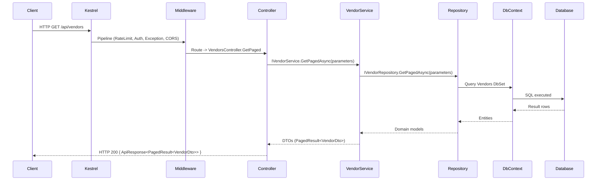
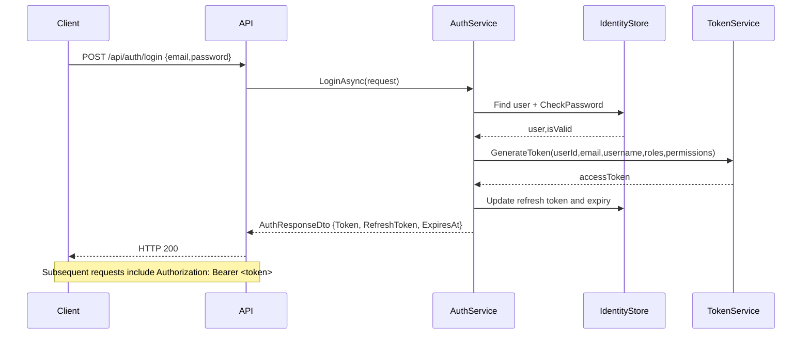
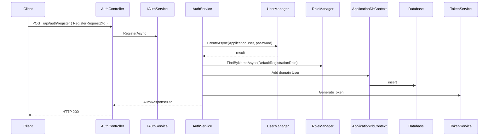
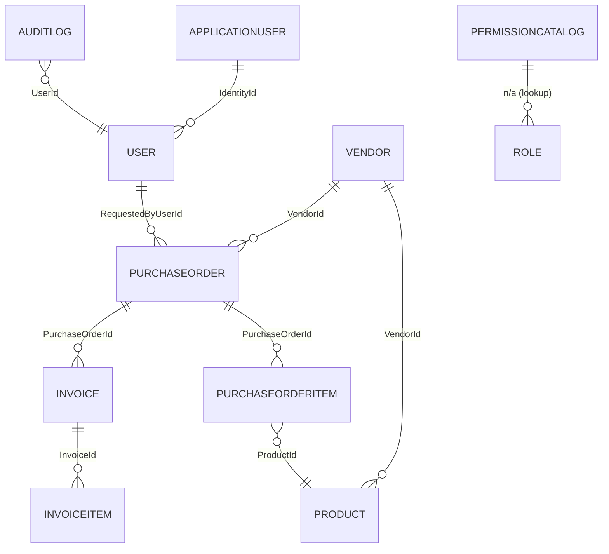
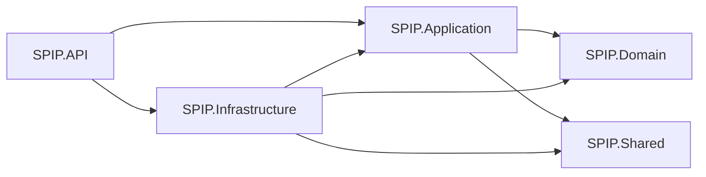

<!--
  Auto-generated comprehensive technical documentation for SPIP backend
  Generated by automated assistant based on repository analysis.
-->

# SPIP Backend � Complete Technical Documentation

This document is a comprehensive, developer-oriented reference for the SPIP backend solution located in this repository. It is intended to onboard a senior backend engineer and explain architecture, code structure, flows, and operational instructions.

Files and classes referenced use the repository paths and class names as implemented.

---

# 1. Project Overview

- Project purpose

  Smart Procurement Intelligence Platform (SPIP) is a backend system that centralizes procurement data (vendors, products, purchase orders, invoices, approvals, audit logs) and provides APIs for ingestion (Excel imports), user and role management, permission-based authorization, and analytics (dashboard statistics).

- Business domain

  Procurement and invoice processing for enterprise customers. It supports importing purchase orders from vendor-provided Excel files, mapping vendor-specific Excel columns to system fields, maintaining product catalogs, purchase order lifecycle, user and role management with permission claims, and audit logging.

- Main objectives

  - Provide secure API endpoints for CRUD operations on vendors, products, users, roles, permissions, and purchase orders.
  - Support Excel-based PO import with vendor-specific mappings using ClosedXML.
  - Authenticate users with JWT and ASP.NET Identity; support refresh tokens.
  - Maintain domain audit logs and permission catalog seeded at startup.
  - Enforce permission-based policies for granular authorization.

- Technologies used

  - .NET 8 (C# 12)
  - ASP.NET Core Web API
  - Entity Framework Core (SQL Server provider)
  - ASP.NET Core Identity (IdentityRole<Guid>, ApplicationUser)
  - AutoMapper
  - FluentValidation
  - Serilog for logging
  - ClosedXML for Excel parsing
  - Rate limiting via built-in RateLimiter

- Solution architecture

  The solution is split into five projects (Clean Architecture-inspired):
  - `SPIP.API` � Presentation / API layer.
  - `SPIP.Application` � Application services, DTOs, interfaces, validation, mapping.
  - `SPIP.Domain` � Domain entities, enums, constants, base types.
  - `SPIP.Infrastructure` � EF Core DbContext, repositories, identity, external integrations, implementation of application interfaces.
  - `SPIP.Shared` � Shared utilities, response types, result patterns, pagination.

---

# 2. Solution Structure

Below is an explanation of each project in the solution.

- `SPIP.API`
  - Responsibility: Exposes REST API endpoints, configures middleware pipeline, seeding, logging, CORS, Swagger, rate limiting and wires `ICurrentUserService`.
  - Why it exists: Separate presentation concerns from business logic and persistence.
  - Dependencies: `SPIP.Application`, `SPIP.Infrastructure`, `SPIP.Shared`.
  - Communication: Calls `Application` services (e.g., `IVendorService`, `IAuthService`) injected via DI. Uses `ApplicationDbContext` for some read-only permission endpoints.

- `SPIP.Application`
  - Responsibility: Defines service interfaces, DTOs, validation rules, mapping profiles and core application services (business logic orchestration) that are independent of frameworks.
  - Why it exists: Allows unit tests and clear boundaries between API and Infrastructure implementations.
  - Dependencies: `SPIP.Domain`, `SPIP.Shared`.
  - Communication: Exposes interfaces consumed by `SPIP.API` and implemented in `SPIP.Infrastructure`.

- `SPIP.Domain`
  - Responsibility: Domain models (entities), enums, constants, and base classes such as `BaseEntity`.
  - Why it exists: Centralized domain knowledge and structure for persistence and business rules.
  - Dependencies: None (core domain only).
  - Communication: Referenced by `SPIP.Application` DTO mappings and `SPIP.Infrastructure` EF Core context.

- `SPIP.Infrastructure`
  - Responsibility: Concrete implementations � EF Core `ApplicationDbContext`, repositories (generic and specific), Identity `ApplicationUser`, authentication (`TokenService`), service implementations (e.g., `AuthService`, `VendorService`, `ClosedXmlImportService`), and DI registration.
  - Why it exists: Encapsulate I/O, persistence, identity and third-party integrations.
  - Dependencies: `SPIP.Domain`, `SPIP.Application`, `SPIP.Shared`.
  - Communication: Implements `I*` interfaces from `SPIP.Application` and is consumed by `SPIP.API` through DI.

- `SPIP.Shared`
  - Responsibility: Cross-cutting types: `ApiResponse<T>`, `Result<T>`, pagination helpers, common constants and utilities.
  - Why it exists: Avoid duplication across projects.
  - Dependencies: None special.
  - Communication: Used by all other projects for uniform responses and paging.

---

# 3. Folder Documentation

This section explains common folders present across projects and notable examples in this repository. When a folder is not present in a project, it is omitted.

General folders and their purpose (examples found in this codebase):

- Controllers (`SPIP.API\\Controllers`)
  - Purpose: HTTP endpoints using attributes like `[HttpGet]`, `[HttpPost]`.
  - When used: Expose functionality to clients.
  - Who uses it: API clients (frontend, integrators) and internal services via HTTP.
  - Example classes: `AuthController`, `VendorsController`, `ProductsController`, `PurchaseOrdersController`, `UsersController`, `RolesController`, `PermissionsController`, `AuditLogsController`, `DashboardController`.

- Services
  - Purpose: Contain business operations and orchestration (in `SPIP.Application` interfaces and `SPIP.Infrastructure` implementations).
  - When used: Called by controllers.
  - Who uses it: Controllers and other services.
  - Example classes: `SPIP.Application\\Services\\VendorService`, `SPIP.Application\\Services\\PurchaseOrderService`, `SPIP.Infrastructure\\Services\\AuthService`, `ClosedXmlImportService`.

- Repositories (`SPIP.Infrastructure\\Repositories` and `SPIP.Application\\Interfaces\\Repositories`)
  - Purpose: Data access abstractions and concrete EF Core implementations.
  - When used: Application services need data operations.
  - Who uses it: Services (Application layer) and Infrastructure implementations.
  - Example classes: `IGenericRepository<T>`, `GenericRepository<T>`, `UserRepository`, `VendorRepository`, `PurchaseOrderRepository`, `UnitOfWork`.

- Interfaces (`SPIP.Application\\Interfaces`)
  - Purpose: Define contracts for services, repositories, storage, email, and AI.
  - Example classes: `IAuthService`, `ITokenService`, `IUserService`, `IVendorService`, `IClosedXmlImportService`, `IAIExtractionService`, `IFileStorageService`.

- DTOs (`SPIP.Application\\DTOs`)
  - Purpose: Input / output models for API communication, distinct from domain entities.
  - When used: Controllers accept request DTOs and return response DTOs.
  - Example classes: `RegisterRequestDto`, `LoginRequestDto`, `AuthResponseDto`, `VendorDto`, `PurchaseOrderDto`, `ExcelPreviewDto`.

- Validators (`SPIP.Application\\Validators`)
  - Purpose: FluentValidation classes to validate incoming DTOs.
  - Example classes: `RegisterRequestValidator`, `LoginRequestValidator`.

- Extensions (`SPIP.API\\Extensions`)
  - Purpose: Small extension methods to organize startup logic (e.g., `AddSwaggerWithJwt`, `UseGlobalExceptionHandling`).

- Middleware (`SPIP.API\\Middleware`)
  - Purpose: Custom middleware such as `ExceptionMiddleware` used via `UseGlobalExceptionHandling` extension.

- Persistence (`SPIP.Infrastructure\\Persistence`)
  - Purpose: EF Core context, configurations, interceptors and seeders.
  - Example classes: `ApplicationDbContext`, `AuditInterceptor`, `RoleSeeder`, `AdminUserSeeder`.

- Authentication (`SPIP.Infrastructure\\Authentication`)
  - Purpose: JWT token creation and related helpers.
  - Example classes: `TokenService`, `JwtSettingsSetup`.

- Mappings (`SPIP.Application\\Mapping`)
  - Purpose: AutoMapper `Profile` implementations.
  - Example classes: `MappingProfile`.

- Configurations (`SPIP.Infrastructure\\Persistence\\Configurations`)
  - Purpose: Fluent EF Core configurations for entities, e.g., `VendorConfiguration`, `ProductConfiguration`, `PurchaseOrderConfiguration`, etc.

- Migrations (`SPIP.Infrastructure\\Migrations`)
  - Purpose: EF Core database migrations history files.

- Shared (`SPIP.Shared`)
  - Purpose: Common response and result wrappers, pagination, and constants.

When reading code, prefer `DTOs` and `Services` for understanding business flows; repositories and `DbContext` detail physical storage.

---

# 4. Clean Architecture

- Layer responsibilities
  - API: Presentation and HTTP concerns.
  - Application: Business use-cases, DTOs, validation, mapping and interfaces.
  - Domain: Core entities and domain rules.
  - Infrastructure: Implementations for persistence, identity, tokens, external services.

- Dependency Rule
  - Outer layers (API, Infrastructure) depend on inner layers (Application, Domain). Application depends on Domain but not on Infrastructure.

- Separation of Concerns
  - DTOs are separate from domain entities.
  - Services orchestrate business logic and interact with repositories.

- Why chosen
  - Improves testability, maintainability, and separation of responsibilities. Keeps domain independent of frameworks and databases.

---

# 5. Dependency Injection

Two central DI registration locations:

- `SPIP.Application\\DependencyInjection\\DependencyInjection.cs`
  - Registers AutoMapper and FluentValidation and some application scoped services like `IVendorService` -> `VendorService`.
  - Lifetime: `Scoped` for services that access DbContext.
  - Consumers: Controllers and other services.

- `SPIP.Infrastructure\\DependencyInjection\\DependencyInjection.cs`
  - Registers:
    - `ApplicationDbContext` with SQL Server and `AuditInterceptor`.
    - Identity: `AddIdentity<ApplicationUser, IdentityRole<Guid>>()`.
    - Binds `JwtSettings` from configuration.
    - Configures JWT Bearer authentication with `TokenValidationParameters` that use `JwtSettings` (`Issuer`, `Audience`, `Key`).
    - Dynamically registers permission policies by reflecting `SPIP.Domain.Constants.Permissions` nested classes and adding policies that require a claim `Permission` with the respective value.
    - Registers repositories and service implementations. Examples:
      - `IUserRepository` -> `UserRepository` (Scoped)
      - `ITokenService` -> `TokenService` (Scoped)
      - `IAuthService` -> `AuthService` (Scoped)

  - Why they exist: Provide concrete implementations of application interfaces, configure identity and authentication, and seed permission policies at startup.

  - Lifetimes: Mostly `Scoped` because services depend on `DbContext` which is `Scoped`.

---

# 6. Request Lifecycle

Sequence diagram (Mermaid) that traces a typical request (example: GET `api/vendors`):



This maps to classes:
  - Middleware: `SPIP.API.Middleware.ExceptionMiddleware`, built-in `Authentication`, `Authorization`, `RateLimiter`.
  - Controller: `SPIP.API.Controllers.VendorsController`.
  - Application service: `SPIP.Application.Services.VendorService`.
  - Repository: `SPIP.Infrastructure.Repositories.VendorRepository` (inherits `GenericRepository<T>`).
  - DbContext: `SPIP.Infrastructure.Persistence.Context.ApplicationDbContext`.

---

# 7. Middleware Pipeline

Execution order in `Program.cs` (`ConfigurePipeline`):
  1. Swagger (only in development)
  2. Global Exception Handling (`UseGlobalExceptionHandling`) � registers `ExceptionMiddleware` which converts exceptions to `ApiResponse` with appropriate HTTP status codes.
  3. HTTPS Redirection (`UseHttpsRedirection`)
  4. CORS (`UseCors("AllowFrontend")`) � policy configured in `Program.cs` to allow `localhost:4200`.
  5. Rate Limiter (`UseRateLimiter`) � configured in `Program.cs` with a global limiter and an `AuthPolicy` limiter.
  6. Authentication (`UseAuthentication`) � JWT Bearer configured in `SPIP.Infrastructure.DependencyInjection`.
  7. Authorization (`UseAuthorization`) � policies added for each permission string.
  8. Routing / Endpoints (`MapControllers`).

Details:
  - Authentication: JWT Bearer validates token using `JwtSettings` and `TokenValidationParameters` (zero clock skew).
  - Authorization: Policies mapped dynamically; policies look for a claim `Permission` with the required string.
  - Exception Middleware: `ExceptionMiddleware` logs exceptions and converts them into `ApiResponse` with codes based on exception type (e.g., `NotFoundException` -> 404, `ValidationAppException` -> 400).
  - Swagger: Enabled in development with JWT security definition via `AddSwaggerWithJwt` extension.

---

# 8. Authentication & Authorization

This project uses ASP.NET Identity + JWT with a custom permission-based authorization scheme.

- ASP.NET Identity
  - Implementation: `SPIP.Infrastructure.Identity.ApplicationUser` (inherits IdentityUser<Guid>) and registered in `AddIdentity<>()` in `SPIP.Infrastructure.DependencyInjection`.
  - Data stored via `AddEntityFrameworkStores<ApplicationDbContext>()`.

- JWT
  - Token creation: `SPIP.Infrastructure.Authentication.TokenService.GenerateToken` uses `JwtSettings` (key, issuer, audience, expiration) and signs with HMAC-SHA256.
  - JWT payload includes standard claims and custom claims: `ClaimTypes.Role` entries and claim type `Permission` entries.

- Refresh Tokens
  - `TokenService.GenerateRefreshToken()` creates a random Base64 token.
  - `AuthService` stores refresh token in `ApplicationUser.RefreshToken` and `RefreshTokenExpiryTime` and validates them in `RefreshTokenAsync`.

- Claims, Roles, Permissions
  - Roles are standard Identity roles (GUID primary key type). Roles also have claims of type `Permission` that represent allowed actions.
  - Permissions are seeded into `PermissionCatalog` table and are used to dynamically create authorization policies. The permission strings are defined in `SPIP.Domain.Constants.Permissions`.

- Policies
  - Created automatically in `SPIP.Infrastructure.DependencyInjection.AddInfrastructure`: iterate nested types of `Permissions`, reflect constant fields and call `options.AddPolicy(permission, policy => policy.RequireClaim("Permission", permission))`.

- CurrentUserService
  - Implementation: `SPIP.API.Services.CurrentUserService` (registered in `Program.cs` as `ICurrentUserService`). Provides `UserId`, `Email`, and `IsAuthenticated` by reading `HttpContext.User` claims.

- Security Flow (sequence diagram)



---

# 9. Controllers Documentation

Each controller in `SPIP.API\\Controllers` maps to a logical area. Below are responsibilities and key endpoints.

- `AuthController` (`api/auth`)
  - Responsibility: Register, Login, Refresh token.
  - Endpoints:
    - POST `api/auth/register` � accepts `RegisterRequestDto` validated by `RegisterRequestValidator` and calls `IAuthService.RegisterAsync`.
    - POST `api/auth/login` � accepts `LoginRequestDto` validated by `LoginRequestValidator` and calls `IAuthService.LoginAsync`. Rate-limited with `AuthPolicy`.
    - POST `api/auth/refresh-token` � accepts `RefreshTokenRequestDto` and calls `IAuthService.RefreshTokenAsync`.
  - Authorization: register and login are anonymous; refresh token requires valid refresh token in request.

- `UsersController` (`api/users`)
  - Responsibility: CRUD and paging of domain `User` records.
  - Key endpoints:
    - GET `api/users` � returns paged `UserDto`, requires `Permissions.Users.View` policy.
    - GET `api/users/{id}` � get user by id.
    - PUT `api/users/{id}` � update user.
    - PUT `api/users/{id}/toggle-status` � toggle active status; requires `Permissions.Users.Update`.
    - DELETE `api/users/{id}` � deactivate; requires `Permissions.Users.Deactivate`.

- `RolesController` (`api/roles`)
  - Responsibility: Manage roles and assign permissions.
  - Key endpoints: GET, POST, PUT, DELETE for roles and POST `/{id}/permissions` to assign permission claims.
  - Authorization: requires various `Permissions.Roles.*` policies.

- `PermissionsController` (`api/permissions`)
  - Responsibility: Read permission catalog grouped by module.
  - Key endpoint: GET `api/permissions` � returns `List<PermissionGroupDto>`.

- `VendorsController` (`api/vendors`)
  - Responsibility: Manage vendor entities.
  - Key endpoints: GET paged, GET by id, POST create, PUT update, DELETE, PUT toggle-approval.
  - Authorization: uses `Permissions.Vendors.*` policies.

- `VendorMappingsController` (`api/vendor-mappings`)
  - Responsibility: Manage vendor-specific Excel-to-system field mappings.
  - Key endpoints: GET `vendor/{vendorId}`, POST create/update, DELETE.

- `ProductsController` (`api/products`)
  - Responsibility: Manage products associated with vendors.

- `PurchaseOrdersController` (`api/purchase-orders`)
  - Responsibility: Create purchase orders via Excel import, preview Excel, paging, delete.
  - Key endpoints:
    - POST `api/purchase-orders/import` � accepts `multipart/form-data` with file and `VendorId`, calls `IPurchaseOrderService.ImportFromExcelAsync`.
    - POST `api/purchase-orders/import-preview` � returns `ExcelPreviewDto` via `IClosedXmlImportService.GetExcelPreviewAsync`.

- `AuditLogsController` (`api/audit-logs`)
  - Responsibility: Retrieve audit logs.

- `DashboardController` (`api/dashboard`)
  - Responsibility: Return aggregated statistics via `IDashboardService.GetStatsAsync`.

Refer to the controllers' files in `SPIP.API\\Controllers` for exact method signatures and attributes.

---

# 10. Endpoint Documentation

Below is a template for documenting endpoints. For brevity we present representative endpoints with full details; repeat the pattern for each endpoint in controllers.

- POST `api/auth/login`
  - HTTP Method: POST
  - Authorization: Anonymous
  - Request: `LoginRequestDto` (see `SPIP.Application\\DTOs\\Auth\\LoginRequestDto.cs`)
  - Response: `ApiResponse<AuthResponseDto>` where `AuthResponseDto` contains `Token`, `RefreshToken`, user info and lists of `Roles` and `Permissions`.
  - Validation: Validated by `LoginRequestValidator`.
  - Business Rules: Must match a user with active status and correct password; otherwise `UnauthorizedAccessException`.
  - Error Responses: 400 for validation errors; 401 for invalid credentials.
  - Swagger Example: Provided via `AddSwaggerWithJwt` (security definition configured).

- POST `api/purchase-orders/import`
  - HTTP Method: POST
  - Authorization: `[Authorize(Policy = Permissions.POImports.Import)]`
  - Request: multipart/form-data � `File` (Excel), `VendorId` (int) as body model `ImportPurchaseOrderRequest`.
  - Response: `ApiResponse<int>` (id of created purchase order) or failure `ApiResponse` with error message.
  - Validation: File present and not empty; vendor must exist.
  - Business Rules: The `ClosedXmlImportService` uses vendor column mappings to parse rows, matches product by `ErpId`/`Sku`/`Barcode` and assembles `PurchaseOrder` and `PurchaseOrderItem` entities. If no matching items found, import fails.
  - Error Responses: 400 for missing file or mapping or parse errors.

For each endpoint in controllers, use the same structure: URL, method, authorization, DTOs, validations and possible errors.

---

# 11. Business Flows

Representative flows with sequence diagrams.

- Register (High-level)



- Login & Refresh Token (High-level shown earlier in section 8)

- Purchase Order Import

```mermaid
sequenceDiagram
    Client->>PurchaseOrdersController: POST /api/purchase-orders/import (file, vendorId)
    Controller->>IPurchaseOrderService: ImportFromExcelAsync(stream, fileName, vendorId)
    Service->>IClosedXmlImportService: ParsePurchaseOrderExcelAsync(stream, vendorId)
    ClosedXmlImportService->>IVendorColumnMappingRepository: GetByVendorIdAsync(vendorId)
    ClosedXmlImportService->>IProductRepository: GetPagedAsync for vendor products
    ClosedXmlImportService->>PurchaseOrder: build entity with items
    Service->>IPurchaseOrderRepository: AddAsync(po); SaveChangesAsync()
    Repository->>DbContext: add and commit
    DbContext->>Database: insert PurchaseOrder + Items
    Service-->>Controller: Result<int> (PO id)
    Controller-->>Client: HTTP 200
```

---

# 12. Services Documentation

Selected services and responsibilities:

- `SPIP.Application.Services.VendorService` (implements `IVendorService`)
  - Responsibilities: Get paged vendors, get by id, create/update/delete vendors, toggle approval.
  - Dependencies: `IVendorRepository`.
  - Methods: `GetPagedAsync`, `GetByIdAsync`, `CreateAsync`, `UpdateAsync`, `DeleteAsync`, `ToggleApprovalStatusAsync`.

- `SPIP.Application.Services.PurchaseOrderService` (implements `IPurchaseOrderService`)
  - Responsibilities: Query purchase orders, import from Excel, delete.
  - Dependencies: `IPurchaseOrderRepository`, `IClosedXmlImportService`, `IVendorRepository`.

- `SPIP.Infrastructure.Services.AuthService` (implements `IAuthService`)
  - Responsibilities: Register, login, refresh token, map Identity user to domain user and create tokens.
  - Dependencies: `UserManager<ApplicationUser>`, `RoleManager<IdentityRole<Guid>>`, `ITokenService`, `ApplicationDbContext`.

- `SPIP.Infrastructure.Services.ClosedXmlImportService`
  - Responsibilities: Parse uploaded Excel file using `ClosedXML`, map columns using vendor mappings, match products and return `PurchaseOrder` domain entity.
  - Dependencies: `IVendorColumnMappingRepository`, `IProductRepository`, `ICurrentUserService`, `IUserRepository`.

---

# 13. Repository Layer

- `IGenericRepository<T>` � generic CRUD contract used across domain entities.

- `GenericRepository<T>` � EF Core-based implementation providing basic operations (`GetByIdAsync`, `GetAllAsync`, `AddAsync`, `UpdateAsync`, `DeleteAsync`, `SaveChangesAsync`).

- Specific repositories implement domain-specific queries:
  - `UserRepository` � `GetPagedAsync`, `GetByEmailAsync`, `GetByIdentityIdAsync`.
  - `PurchaseOrderRepository` � includes `GetWithItemsByIdAsync`.
  - `VendorColumnMappingRepository`, `VendorRepository`, `ProductRepository` � vendor/product-specific queries.

- `UnitOfWork` � registered as `IUnitOfWork` (exists in `SPIP.Infrastructure\\Repositories\\UnitOfWork.cs`) to coordinate multiple repositories, if needed.

---

# 14. Domain Layer

Key entities:

- `User` (`SPIP.Domain.Entities.User`)
  - Fields: `IdentityId` (GUID to ASP.NET Identity user), `FullName`, `Email`, `RoleId`, `RoleName`, `IsActive`.
  - Relations: One-to-many to `PurchaseOrder`, `Approval`, `Notification`, `AuditLog`.

- `Vendor` (`SPIP.Domain.Entities.Vendor`)
  - Fields: `ErpId`, `Name`, `TaxRegistrationNumber`, `ContactEmail`, `IsApproved`.
  - Relations: Products, PurchaseOrders, Invoices, PriceHistories.

- `Product`, `PurchaseOrder`, `PurchaseOrderItem`, `Invoice`, `Approval`, etc.

- `PermissionCatalog` � holds seeded permissions used for UI and policy creation.

Constants: `SPIP.Domain.Constants.Permissions` contains nested static classes enumerating system permissions.

---

# 15. Database Documentation

- DbContext
  - `SPIP.Infrastructure.Persistence.Context.ApplicationDbContext` extends `IdentityDbContext<ApplicationUser, IdentityRole<Guid>, Guid>`.
  - DbSets expose both identity and domain entities (e.g., `Vendors`, `Products`, `PurchaseOrders`, `PermissionCatalogs`).
  - `OnModelCreating` applies EF configurations and seeds `PermissionCatalog` from the `Permissions` constants.

- Entities -> Tables
  - `Users`: domain users stored in `Users` table (domain) while Identity users are in `AspNetUsers` (Identity). Mapping: `User.IdentityId` references `AspNetUsers.Id`.
  - `Vendors`, `Products`, `PurchaseOrders`, `PurchaseOrderItems`, `Invoices`, `InvoiceItems`, `PermissionCatalogs`, `AuditLogs`, `AIExtractionResults`, `UploadedFiles`, `Approvals`, `ApprovalHistories`.

- Relationships
  - `PurchaseOrder` -> 1 `Vendor` via `VendorId`.
  - `PurchaseOrder` -> many `PurchaseOrderItem`.
  - `PurchaseOrderItem` -> `Product` via `ProductId`.
  - `AIExtractionResult` -> `Invoice` via `InvoiceId`.

- Migrations
  - Stored under `SPIP.Infrastructure\\Migrations` and represent incremental DB schema changes.

- ER Diagram (Mermaid)



Note: `APPLICATIONUSER` is the Identity user (table `AspNetUsers`) which is related to domain `User` via `IdentityId`.

---

# 16. DTOs

DTOs separate API contracts from domain entities. Examples:

- `AuthResponseDto` (`SPIP.Application.DTOs.Auth.AuthResponseDto`)
  - Purpose: Return tokens and user info on login/register/refresh.

- `RegisterRequestDto`, `LoginRequestDto`, `RefreshTokenRequestDto`
  - Purpose: Input models validated by FluentValidation rules.

- `VendorDto`, `ProductDto`, `PurchaseOrderDto`, `PurchaseOrderItemDto`
  - Purpose: Shape client-facing JSON responses; built from domain entities in services.

Mapping typically occurs in application services or AutoMapper profiles (e.g., `MappingProfile` for `User`.

---

# 17. AutoMapper

- Profiles: `SPIP.Application.Mapping.MappingProfile` registers maps (e.g., `User` -> `UserDto` mapping `Role` from `RoleName`).

- Mapping Flow: Controller -> Service returns domain model(s) -> Service maps to DTO(s) via AutoMapper or manual mapping helper functions.

- Why mapping: Prevent exposing domain internal structure, simplify response DTOs, and adapt fields.

---

# 18. Validation

- FluentValidation
  - Validators are registered via `services.AddValidatorsFromAssembly(...)` in `SPIP.Application.DependencyInjection`.
  - Examples: `RegisterRequestValidator`, `LoginRequestValidator`.

- Validation Pipeline
  - Controllers explicitly validate DTOs via injected `IValidator<T>` instances and return `BadRequest` with `ApiResponse<T>` when validation fails.
  - There is also `ValidationAppException` used by application code to indicate validation problems.

---

# 19. Exception Handling

- Custom Exceptions
  - `SPIP.Application.Exceptions.ValidationAppException` used to propagate validation errors with an `Errors` collection.
  - `NotFoundException` used to indicate missing resources.

- Global Exception Middleware
  - `SPIP.API.Middleware.ExceptionMiddleware` catches exceptions and converts them to JSON `ApiResponse<object>.FailureResponse(...)` and sets the HTTP status code based on exception type.

- Error Response Format
  - All error responses follow `SPIP.Shared.Responses.ApiResponse<T>` with `Success = false`, `Message` and `Errors`.

---

# 20. Background Jobs

No background jobs are implemented in the inspected code. There are empty directories in `SPIP.Infrastructure\\AI` and `SPIP.Infrastructure\\Email` indicating planned integrations.

---

# 21. Email Module

An email sender interface `SPIP.Application.Interfaces.Email.IEmailSender` exists. No concrete implementations were found in `SPIP.Infrastructure\\Email` (folder contains `.gitkeep`).

Planned responsibilities:
  - Template rendering, providers for SMTP or third-party services, and a service to send transactional emails (registration, notifications).

---

# 22. Storage Module

`IFileStorageService` exists in `SPIP.Application\\Interfaces\\Storage\\IFileStorageService.cs` but no implementation was found. The system uses `UploadedFile` entity and `UploadedFiles` DbSet in `ApplicationDbContext` suggesting a storage and metadata approach.

Common responsibilities: file upload, validation, storage provider abstraction (local, S3, Azure Blob), and metadata persistence.

---

# 23. AI Module

- Purpose: Extract structured invoice data from uploaded files. Interfaces exist (`IAIExtractionService`) and `AIExtractionResult` entity exists.

- Status: No concrete AI implementation found (`SPIP.Infrastructure\\AI` contains `.gitkeep`). This is a planned/placeholder area.

- Flow (planned): Upload invoice file -> `IAIExtractionService.ExtractInvoiceDataAsync` -> store raw extracted JSON in `AIExtractionResults` table with `ModelUsed` and `ConfidenceScore`.

---

# 24. Configuration

- `appsettings.json` (not shown inline) should contain sections like `ConnectionStrings:DefaultConnection` and `JwtSettings` matching `SPIP.Application.Common.JwtSettings.SectionName`.

- Options Pattern
  - `services.Configure<JwtSettings>(configuration.GetSection(JwtSettings.SectionName));` and `IOptions<JwtSettings>` injected in `AuthService` and `TokenService`.

- Secrets
  - Keep `JwtSettings:Key` and connection strings in secure storage (user secrets, environment variables, or Key Vault) when deploying.

---

# 25. Security

- Password Hashing: Delegated to ASP.NET Identity which uses secure password hashing.

- JWT Security: `TokenService` uses symmetric key (HMAC-SHA256). Ensure the `JwtSettings.Key` is sufficiently long and stored securely.

- Permission System: Uses `Permission` claims attached to roles. Policies require claim `Permission` with specific value.

- Authorization Policies: Automatically generated from `SPIP.Domain.Constants.Permissions` at startup.

- Best Practices: Keep keys secret, enforce HTTPS, employ short access token lifetimes and rotate refresh tokens regularly.

---

# 26. Performance

- Pagination
  - Paged endpoints return `PagedResult<T>` (page number, size, total count) and use `Skip`/`Take` in repository queries.

- Query Optimization
  - Repositories include filtering and projection. Use `AsNoTracking` when appropriate (not currently applied everywhere � improvement point).

- Async Programming
  - Repositories and services use async/await and EF Core async methods.

- Caching
  - No caching layer currently implemented. Consider MemoryCache or distributed cache for expensive reads.

---

# 27. Logging

- Serilog configured in `Program.cs` via `ConfigureLogging(builder)` reading from configuration and writing to Console. `builder.Host.UseSerilog()` is used to replace default logging.

- `ExceptionMiddleware` logs exceptions via `ILogger<ExceptionMiddleware>`.

---

# 28. Sprint Documentation

The repository uses a `Sprint_two` branch. Implemented features (as observed):
  - Authentication and registration with refresh token flow.
  - Role and permission system seeded and mapped to policies.
  - Vendor, product, and purchase order management with Excel import preview and parsing.
  - Audit logging interceptor.
  - Swagger with JWT configuration.

Future sprints likely include Email, AI extraction implementation, storage providers and background jobs.

---

# 29. Complete Dependency Graph

Project dependencies (Mermaid):



Request Flow and Authentication/Authorization flows were provided earlier as sequence diagrams.

---

# 30. Complete Class Relationship Diagrams

User � PurchaseOrder � PurchaseOrderItem � Product (see ER diagram in section 15). Additional class relations are in Domain entities files.

---

# 31. API Testing

Swagger is enabled in development and configured to accept a Bearer token. Example requests are discoverable via Swagger UI at `/swagger` when running locally.

For each endpoint, provide example request/response bodies in Swagger using DTO definitions (the project currently registers Swagger but does not annotate example payloads; adding `SwaggerRequestExample` or `SwaggerResponseExample` would improve this).

---

# 32. How to Run the Project

- Prerequisites
  - .NET 8 SDK
  - SQL Server instance (connection string configured in `appsettings.json`)
  - (Optional) tools: EF Core CLI, dotnet-ef

- Packages
  - Packages restored via `dotnet restore`.

- Database & Migrations
  - Migrations present in `SPIP.Infrastructure\\Migrations`. To apply migrations:
    - dotnet ef database update --project SPIP.Infrastructure --startup-project SPIP.API

- Configuration
  - Provide `ConnectionStrings:DefaultConnection` and `JwtSettings` in `appsettings.Development.json` or environment variables.

- Running API
  - From solution root: `dotnet run --project SPIP.API` or run from IDE.

- Seeding
  - On startup `Program.Main` calls `SeedIdentityDataAsync` which uses `RoleSeeder` and `AdminUserSeeder` to seed roles and initial admin user.

- Running Background Jobs
  - None implemented. Background service scaffolding would be registered in DI and hosted by worker or via `IHostedService`.

- Testing
  - Unit and integration tests are not present in the inspected workspace (add test projects to cover services and repositories).

---

# 33. Project Summary

- Architecture: Clean Architecture-inspired multi-project solution with clear separation of concerns.
- Strong points:
  - Clear DI and registration of services and repositories.
  - Permission-driven authorization model with policy auto-generation.
  - Excel import pipeline with vendor mapping supports real-world vendor variability.
  - Consistent ApiResponse and Result patterns for responses and service returns.
- Extension points:
  - Implement AI extraction service in `SPIP.Infrastructure\\AI`.
  - Implement email sender in `SPIP.Infrastructure\\Email`.
  - Add file storage implementations for `IFileStorageService`.
  - Add caching for commonly read data (permissions, product catalogs).
- Future improvements:
  - Add unit and integration tests for critical flows.
  - Add more AutoMapper profiles and consistent mapping usage.
  - Harden error handling and provide consistent error codes.
  - Move secret configuration to environment or secret manager.

---

Appendix: Key files and entry points

- `SPIP.API\\Program.cs` � application startup and pipeline configuration
- `SPIP.Infrastructure\\DependencyInjection\\DependencyInjection.cs` � service registrations, identity and JWT configuration
- `SPIP.Infrastructure\\Persistence\\Context\\ApplicationDbContext.cs` � EF Core context and permission seeding
- `SPIP.Infrastructure\\Services\\AuthService.cs` � authentication, registration and refresh token flow
- `SPIP.Infrastructure\\Services\\ClosedXmlImportService.cs` � Excel parsing and mapping logic
- `SPIP.Application\\Services\\PurchaseOrderService.cs` � orchestrates import and persistence

For any further detailed per-file questions, consult the corresponding file under the repository paths listed above.
