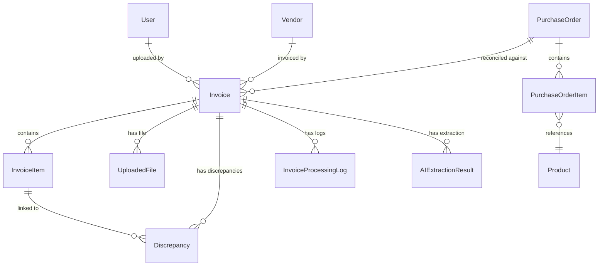

# Data Model: Intelligent Invoice Processing Pipeline

## Entity Changes Summary

| Entity | Action | Location |
|--------|--------|----------|
| Invoice | MODIFY — add fields | `SPIP.Domain/Entities/Invoice.cs` |
| InvoiceItem | MODIFY — add SupplierSku | `SPIP.Domain/Entities/InvoiceItem.cs` |
| Discrepancy | MODIFY — add DiscrepancyType, InvoiceItemId | `SPIP.Domain/Entities/Discrepancy.cs` |
| UploadedFile | MODIFY — add StoredFileName, OriginalFileName | `SPIP.Domain/Entities/UploadedFile.cs` |
| InvoiceProcessingLog | NEW | `SPIP.Domain/Entities/InvoiceProcessingLog.cs` |
| InvoiceStatus | MODIFY — replace enum values | `SPIP.Domain/Enums/InvoiceStatus.cs` |
| DiscrepancyType | NEW | `SPIP.Domain/Enums/DiscrepancyType.cs` |

---

## Invoice (MODIFY)

**File**: `SPIP.Domain/Entities/Invoice.cs`

### Current Fields
- `Id` (int, PK) — from BaseEntity
- `InvoiceNumber` (string)
- `VendorId` (int, FK → Vendor)
- `PurchaseOrderId` (int, FK → PurchaseOrder) — required at upload
- `Status` (InvoiceStatus)
- `TotalAmount` (decimal)
- `InvoiceDate` (DateTime)
- `CreatedAt`, `UpdatedAt`, `IsDeleted` — from BaseEntity

### Fields to Add
| Field | Type | Required | Notes |
|-------|------|----------|-------|
| `VendorName` | string | Yes | AI-extracted vendor name (stored for audit; VendorId links to Vendor entity) |
| `Currency` | string | No | Defaults to "USD". From AI extraction |
| `Subtotal` | decimal | No | Pre-tax subtotal from AI extraction |
| `Vat` | decimal | No | VAT/tax amount from AI extraction |
| `UploadedByUserId` | int | Yes | FK → User. Tracks data ownership for FR-024 |
| `UploadedByUser` | User? | — | Navigation property |

### Navigation Properties (existing, unchanged)
- `Items` → `ICollection<InvoiceItem>`
- `UploadedFiles` → `ICollection<UploadedFile>`
- `Discrepancies` → `ICollection<Discrepancy>`
- `AIExtractionResults` → `ICollection<AIExtractionResult>`

### Navigation Properties to Add
- `ProcessingLogs` → `ICollection<InvoiceProcessingLog>`

### Validation Rules
- `InvoiceNumber`: Required, max 100 chars
- `TotalAmount`: Required, must be > 0
- `InvoiceDate`: Required, must not be future date
- `PurchaseOrderId`: Required, non-nullable int, must reference valid PO
- `UploadedByUserId`: Required, must reference valid user

---

## InvoiceItem (MODIFY)

**File**: `SPIP.Domain/Entities/InvoiceItem.cs`

### Current Fields
- `Id`, `InvoiceId`, `Invoice?`, `ProductId?`, `Product?`, `Description`, `Quantity`, `UnitPrice`, `LineTotal`

### Fields to Add
| Field | Type | Required | Notes |
|-------|------|----------|-------|
| `SupplierSku` | string | Yes | AI-extracted `supplierSku`. Used as matching key for PO reconciliation |

### Validation Rules
- `SupplierSku`: Required, max 50 chars
- `Quantity`: Required, must be > 0
- `UnitPrice`: Required, must be > 0
- `LineTotal`: Required, must be ≥ 0

---

## Discrepancy (MODIFY)

**File**: `SPIP.Domain/Entities/Discrepancy.cs`

### Current Fields
- `Id`, `InvoiceId`, `Invoice?`, `FieldName`, `ExpectedValue`, `ActualValue`, `IsResolved`

### Fields to Add
| Field | Type | Required | Notes |
|-------|------|----------|-------|
| `DiscrepancyType` | DiscrepancyType | Yes | Enum: MissingSku, MissingFromInvoice, QuantityMismatch, UnitPriceMismatch, AmountMismatch |
| `InvoiceItemId` | int? | No | FK → InvoiceItem. Null for MissingFromInvoice (PO item has no invoice item) |
| `InvoiceItem` | InvoiceItem? | — | Navigation property |

### Validation Rules
- `DiscrepancyType`: Required
- `FieldName`: Required, max 100 chars
- `ExpectedValue`, `ActualValue`: Required, max 200 chars each

---

## UploadedFile (MODIFY)

**File**: `SPIP.Domain/Entities/UploadedFile.cs`

### Current Fields
- `Id`, `FileName`, `StoragePath`, `ContentType?`, `FileSizeBytes`, `InvoiceId?`, `Invoice?`

### Fields to Add
| Field | Type | Required | Notes |
|-------|------|----------|-------|
| `OriginalFileName` | string | Yes | The user's original filename (preserved for download) |
| `StoredFileName` | string | Yes | GUID-based filename on disk (security) |

### Notes
- Existing `FileName` field can be repurposed as `OriginalFileName`, or both can coexist. Recommend renaming `FileName` → keep for backward compat and add `StoredFileName`.

---

## InvoiceProcessingLog (NEW)

**File**: `SPIP.Domain/Entities/InvoiceProcessingLog.cs`

| Field | Type | Required | Notes |
|-------|------|----------|-------|
| `Id` | int | PK | From BaseEntity |
| `InvoiceId` | int | Yes | FK → Invoice |
| `Invoice` | Invoice? | — | Navigation property |
| `FromStatus` | InvoiceStatus? | No | Null for the initial "Uploaded" event |
| `ToStatus` | InvoiceStatus | Yes | The status after this event |
| `EventType` | string | Yes | e.g., "StatusChange", "ValidationError", "AIExtractionComplete" |
| `Message` | string | No | Human-readable description or error message |
| `CreatedAt` | DateTime | Yes | From BaseEntity — serves as the event timestamp |

### Validation Rules
- `EventType`: Required, max 100 chars
- `Message`: Optional, max 2000 chars

---

## InvoiceStatus Enum (MODIFY)

**File**: `SPIP.Domain/Enums/InvoiceStatus.cs`

### Current Values
```
Pending = 1, Matched = 2, Discrepant = 3, Approved = 4, Paid = 5, Rejected = 6
```

### New Values (replace entirely)
```
Uploaded = 1,
Queued = 2,
Processing = 3,
Extracted = 4,
Validated = 5,
Compared = 6,
Completed = 7,
Failed = 8,
NeedsReview = 9
```

### State Transitions
```
Uploaded → Queued → Processing → Extracted → Validated → Compared → Completed
                 Processing → Failed (AI error / timeout)
                 Extracted → NeedsReview (business validation failure)
                 Validated → NeedsReview (PO not found)
```

---

## DiscrepancyType Enum (NEW)

**File**: `SPIP.Domain/Enums/DiscrepancyType.cs`

```
MissingSku = 1,           // Invoice item SKU not found in PO
MissingFromInvoice = 2,   // PO item not present in invoice
QuantityMismatch = 3,     // Quantity differs between invoice and PO
UnitPriceMismatch = 4,    // Unit price differs between invoice and PO
AmountMismatch = 5        // Invoice total ≠ sum of line item amounts
```

---

## Entity Relationship Diagram



---

## EF Core Configuration Changes

### New Configurations Required
| Entity | File | Key Configurations |
|--------|------|--------------------|
| InvoiceConfiguration | MODIFY | Add precision for Subtotal, Vat; add index on UploadedByUserId, Status |
| InvoiceItemConfiguration | MODIFY | Add SupplierSku max length |
| DiscrepancyConfiguration | NEW | Add DiscrepancyType column, FK to InvoiceItem |
| UploadedFileConfiguration | NEW | Add StoredFileName max length, index |
| InvoiceProcessingLogConfiguration | NEW | Add composite index on (InvoiceId, CreatedAt), max lengths |

### Migration Required
- A single EF Core migration to apply all entity changes
